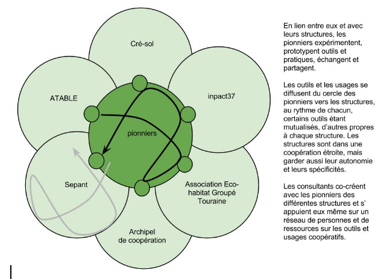
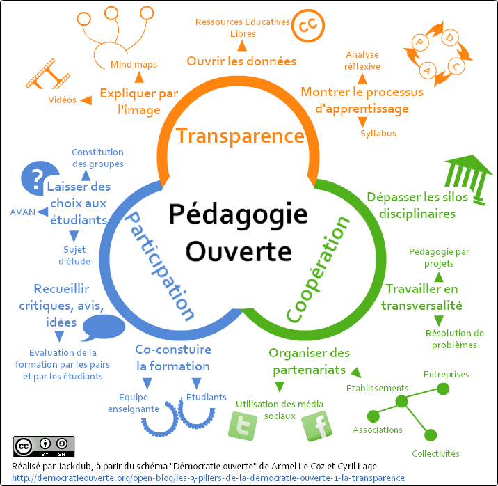

# A propos

Description: Dans le cadre d'un DLA, un collectif d'associations souhaite être accompagné sur sa mise en place d'outils numeriques mutualisés.

Contributeurs:
- Lilian Ricaud <lilious@gmail.com>,
- Laurent Marseault <laurent.marseault@outils-reseaux.org>

Licence: CC-BY-SA

Source:

## Proposition – Accompagnement à la mise en place d’outils numériques partagés pour partager

### Sommaire

- Contexte
- Présentation des intervenants
- Approche et méthode
- Déclinaison de l'offre d'accompagnement
- Calendrier prévisionnel et estimation financière
- ANNEXE: Approche pédagogique ouverte

### Contexte

Dans le cadre du DLA, Les associations, ATABLE, Inpact 37, Sepant, Cré-Sol, Association Eco-habitat Groupé Touraine souhaitent bénéficier d’un accompagnement sur la mise en place d’outils numériques partagés.

Ces associations partagent des valeurs (l’ESS, la coopération, la considération de l’environnement comme un bien précieux...) et souhaitent s’engager dans des modèles coopératifs plus avancés.

Les projets menés par les associations s’appuient sur l’utilisation des TIC que ce soit pour la communication et la collaboration en interne ou externe auprès des publics et adhérents.

De façon générale tout le monde identifie une perte de temps et d’énergie dans le traitement de l’information et se questionne sur les moyens d'appréhender le numérique pour mieux travailler dans le respect des valeurs des structures.

Après l'élaboration de solutions individuelles le collectif souhaite évaluer l'opportunité de les mutualiser. Les membres du collectif souhaitent ainsi dans un premier temps s’aligner sur des outils et des fonctionnements communs gérés chacun dans sa structure. 

Ces outils pourront par la suite être mutualisés. Il est envisagé pour le moment 3 objets de mutualisation :

- 1 hébergement commun
- 1 maintenance mutualisée
- Des outils de partage de données

La constitution d’un groupe d’expertise est aussi évoquée.

Les problématiques soulevées par le DLA sont caractéristiques de celles soulevées par le numérique si on le prend non seulement comme une collections de nouveaux outils mais plutôt comme l’occasion d’un changement de paradigme (cf. http://www.pratiques-collaboratives.net/La-transition-numerique-un-paradigme-pour-aider-a.html )

Au delà des outils, le numérique transforme les manières de travailler et de faire ensemble.

Pourtant la mise en place de logiciels ne suffit pas à obtenir un usage productif / effectif. Le recours aux dispositifs coopératifs demande aussi certains changements culturels, la notion de partage, de pouvoir, de validation, d’abondance, de gestion de projets… sont souvent chamboulées.

Or, les gens ne sont pas des machines que l’on peut “simplement reprogrammer”, au delà des individus, de leur volonté et de leur capacité à coopérer, il existe une culture du groupe avec sa dynamique propre et ses règles explicites ou implicites.

Au delà de la volonté de changer de culture, se pose aussi la question de la capacité à changer et s’approprier les outils, mais aussi leurs usages.

Enfin le numérique et les changements qu’il amène pose de nombreuses questions : Selon Bernard Stiegler c’est un pharmakon, il pourra être "remède, poison  ou bouc émissaire" selon le sens qu'on lui donnera"

C’est autour de ces notions que nous proposons de cheminer avec vous.

### Présentation des intervenants

Tous deux sollicités pour répondre à un appel d’offre sur des sujets liés à la coopération nous avons souhaité nous associer et coopérer plutôt que de nous mettre en concurrence.

#### Laurent Marseault

Expérience professionnelle
Depuis 2009 - Formateur, consultant à Outils-Réseaux : structure d'initiation et d'accompagnement aux pratiques coopératives pour fonctionner en réseaux. Il assure aussi, quand il faut, la direction de la structure.
De 1992 à 2008 - Animateur, directeur adjoint des Ecologistes de l'Euzière, association d'éducation à l'environnement et de vulgarisation d'écologie scientifique.
Formation
Formation de dirigeant de structure de l'Economie Sociale et Solidaire
DUT de Carrières Sociales, option animateur social et socioculturel,
DU Ethologie, étude du comportement animal en milieu naturel
Compétence / expérience
Diagnostic / accompagnement et conseil aux réseaux et associations :
Organisation de dynamiques coopératives, intelligence collective, - Outils de collaboration, mutualisation et de communication 2.0 (intranet, extranet ...)
Gestion analytique des projets, analyse systémique des organisations complexes...
Suivi et organisation de nombreuses formations :
Animacoop, animateur de projets collaboratifs - 
Cooptic, formation de formateurs à la coopération - 
Cartes heuristiques, wiki, FOAD, - 
BTS Gestion et Protection de la Nature - Enseignants - Agents territoriaux - Gardes des Parc Nationaux de France - 
Appui méthodologique aux associations - DLA comptabilité analytique, vie et projet associatif, communication interne et externe...
Conception, rédaction de documents pédagogiques :
Co-rédaction de “Séjours buissonniers » du temps et de l’espace pour des projets d’éducation à l’environnement”
Co-rédaction de “Animature : à vos outils”
Ecolodoc « Enquète d’insectes et Le vin, la vigne et le vigneron »
Faire ensemble, manuel à l’usage des animateurs de réseaux coopératifs http://ebook.coop-tic.eu
Trucs et astuces pour impulser de la coopération http://outils-reseaux.org/ManuelCooperation
Conférences :
la coopération, ligne de fracture entre l'Economie Sociale et Solidaire et l'Economie Cynique et Suicidaire
Les réseaux, collaboratifs, coopératif et autres mots en if
Non, la culture numérique n'est pas un effet de mode, et ce n'est que le début
L'imposture de l'éducation au développement durable

#### Lilian Ricaud

Biologiste de formation ayant travaillé dans de grands organismes de recherche (INRA, Université de Cambridge, CEA), Lilian RICAUD est consultant et formateur spécialisé dans l’utilisation des outils coopératifs depuis 2006.

Auteur d’une  Étude de cas sur la mise en oeuvre de d’outils coopératif en ligne dans une structure ESS « Travail coopératif en ligne à l’IME Mathalin - Retour d’expérience sur la mise en place d’outils coopératifs en ligne et la conduite du changement dans une structure médico-sociale. » Ricaud L. (2012)

Auteur de nombreux articles sur les outils et pratiques collaboratives et membre du comité d’édition du site Pratiques Collaboratives.

Co-Organisateur ou intervenant lors rencontres autour du numérique et de la coopération (MousTIC 2013, 2015, Montpellier; Quizaine des Tiers-Lieux, St-Etienne; Rencontres ROUMICS, Lille; Forum des Usages Coopératifs, Brest),

En savoir plus : http://www.lilianricaud.com/travail-en-reseau/a-propos/

#### Nos valeurs communes

Nous sommes tous deux membres d’un réseau de consultants et formateurs aux usages et outils coopératifs, membres du groupe de pilotage de AnimFr, réseau francophone des animateurs de réseaux coopératifs, impliqués à la mise en oeuvre de pratiques-collaboratives.net, et de nombreux réseaux autour des communs...

Quelques éléments de notre philosophie:

1 - L'accession à l'autonomie : notre accompagnement est destiné à vous faire grandir en autonomie vis à vis des nouveaux outils pour coopérer.
2 - La promotion des outils conviviaux : est convivial l'outil qui augmente l'efficience sans entacher l'autonomie individuelle, l'outil qui ne suscite ni maîtres ni esclaves, l'outil qui élargit le rayon d'action personnel. 
3 - La place de la personne : l'outil coopératif en soi est un leurre, tout outil le devient lorsqu'il est dynamisé par un animateur et au service d'un collectif souhaitant coopérer. Pour ces collectifs, il existe plusieurs niveaux de maturité. Nous accompagnons cette progression en fournissant outils et techniques d'animations ad-hoc.
4 - L'application en interne de tout ce qui est promu à l'externe : des outils informatiques à la prise de décision, de l'autonomie au doute…
5 - La réutilisation, la production et la préservations de biens communs : Nous utilisons le plus souvent possible des logiciels et méthodes libres et reversons tout développement spécifique dans le bien commun. 

### Approche et méthode
#### Co-créer des réponses centrées sur les usagers et les usages

Les 5 associations sont aujourd'hui face à des questions stratégiques complexes auxquelles il n'existe pas LA "bonne réponse, unique". C'est pourquoi nous ne l'apporterons pas.

Plutôt que de répondre aux questions que se posent les associations, nous souhaitons leur donner suffisamment de connaissances pour qu'elles puissent y répondre par elles mêmes, en mettant en place, testant et évaluant des outils, en apprenant à connaître les enjeux et à prendre du recul quant à leurs pratiques.

Nous proposons pour cela de constituer un groupe de pionniers issus de chaque structure avec qui nous co-créerons des réponses bâties autour des usages formulés existants.

Ces pionniers ne devront pas nécessairement être des “experts” du numérique, mais avant tout des personnes intéressées par le sujet et par la possibilité de faire le lien avec leurs structures.

#### Favoriser la mise en place du groupe référent (cercle pionniers) avant les outils

Ce cercle de pionniers aura pour but de tester et d’évaluer différents outils, les usages associés, les possibilités de mutualisation puis d’essaimer outils et pratiques au sein de leur structures. 

Ce cercle joue aussi le rôle de groupe de co-apprentissage et de soutien où les pionniers des différentes structures peuvent partager leurs expériences et se soutenir mutuellement.

La pertinence des outils mis en place viendra de la qualité de la dynamique et de la réflexion ainsi créée.

Nous proposons d'animer des chantiers de réflexion et de prototypage pour aider à impulser de la coopération et à créer une dynamique interne d’abord au sein de ce premier cercle.

Les méthodes et outils que nous apportons permettrons de placer les membres pionniers au cœur de la réflexion mais aussi de prendre du recul et de se nourrir d'expériences voisines pour prendre collectivement les décisions d'orientation stratégique.

Ensemble, avec l'aide d'experts ou de partenaires, nous pourrons dresser pour chacune des thématiques un "état de l'art" regroupant les pistes opérationnelles. Ainsi le collectif disposerait d'une boite à outils complète dans laquelle elle pourra piocher les bonnes questions à poser et à se poser ainsi que les réponses et moyens les plus adaptés à sa situation. D'autres part cet "état de l'art" pourra servir à d'autres structures confrontées actuellement aux mêmes problématiques.

Notre apport se ferait autour de 2 axes :
- outils et méthodes autour des dynamiques de réseaux  
- mise en contact avec d'autres réseaux, lors de rencontres
...
#### De la planification à la stratégie avec une approche agile

Dans un environnement complexe et en changement il est difficile de prévoir tous les besoins dès le début d’un projet, d’où l'intérêt d’une approche « agile » pour le développement des méthodes et outils.

De la même façon il est difficile de prévoir le succès des usages, ou de forcer l’adoption des nouveaux outils et méthodes de travail.

Pour augmenter les chances de succès, mieux vaut passer de la planification (tout détailler) à la stratégie (fixer comme objectif la direction dans laquelle on souhaite aller, mais ne pas figer le choix du chemin à emprunter) ce qui permet d’ajuster le plan initial au fur et à mesure et de saisir les opportunités quand elles se présentent (Lire: Jean-Michel Cornu « la Coopération, Nouvelles Approches »).

Nous vous proposons de travailler ensemble, tout au long du projet, selon des principes inspirés de méthodes de travail « agiles » :

- Définir des usages attendus en les formulant le plus précisément possible “en tant que… je souhaite que… afin que…”
- Hiérarchiser ces usages en fonction d’un critère de “coût de mise en oeuvre” mais aussi “d’impact positifs attendus dans les structures”
- Définir la durée de mini chantiers à durées limités (1 mois) et y mettre en oeuvres les usages définis comme les moins coûteux pour un plus grand effet attendu
- Évaluer le chantier et la pertinence des actions et projeter la séquence suivante.

Cette approche itérative permet de mêler action et réflexion mais aussi tend à améliorer les performances du groupe tout en intégrant les retours de terrain.

#### Un focus sur l’animation

Notre approche est basée sur l’alternance d’apports concernant le sens, les outils et les techniques d’animations. Elle se base sur des pédagogies actives et ouvertes permettant de faire émerger les idées du groupe, de créer une dynamique coopérative et une vision partagée (Voir “approche pédagogique ouverte” en annexe).

Pour nous l’animateur doit être un facilitateur qui aide le groupe à exprimer sa créativité en créant des liens entres dynamique de groupe, vision partagée et sens commun.

Son rôle est proche de celui d’un jardinier, il ne produit pas directement, mais aide le groupe à produire lui même. Il contribuera à créer un écosystème de coopération.

Un de nos critères de réussite de notre accompagnement résidera en la capacité d’autonomisation du groupe.

#### Utilisation d’un intranet interactif pour faciliter l’accompagnement et la coopération

Afin de faire le lien et de faciliter la coopération avec les pionniers un intranet interactif sera mis en place. Cet espace accueillera des ressources et contenus de formation, les compte-rendus de nos réunion, des espaces de co-écriture… Il permettra en outre de rendre visible le processus de travail à la fois aux membres des associations et à l’opérateur DLA.

Il grandira de façon organique au fur et à mesure des besoins et de l’avancée des projets, permettant aux pionniers de vivre une expérience pratique de mise en oeuvre et d’usage d’outil coopératif. 

Il est fort possible que cet espace serve ensuite comme extranet de ce groupe de travail. 

#### Réflexion sur le sens

Notre démarche intègre des réflexions sur les enjeux liés aux numérique, à la coopération et au partage dans le monde de l’ESS.

Nous pensons que l’ESS ne doit pas courir derrière une économie dite “classique” en essayant de la singer mais doit affirmer ses singularités qu’elle doit outiller de manière audacieuse et moderne. Cette économie doit s’élaborer comme celle de demain, gage d’un monde viable, vivable et équitable. Nous sommes l’avenir donc n’ayons pas peur de revendiquer notre fonction exploratoire.

### Déclinaison de l'offre d'accompagnement

Pratiquement, notre accompagnement se base sur une alternance de formation-action en présence, entrecoupées d’accompagnement à distance. 

.jpg)

#### Temps de rencontre en présence
##### Formation des pionniers
2 jours en présence au démarrage

panorama des outils, outils idéal, formation du groupe expert, 
prototypage des premiers outils et usages 
calage des méthodes d’accompagnement

##### Transposition au sein des structures
2 jours en présence à mi parcours
5 x 0,5 journée en intra-structure

Design et ergonomie
Travail pratique sur les outils et personnalisation
Animation des dispositifs coopératifs : freins et facilitateurs
Formation des utilisateurs 

##### Consolidation et essaimage
1 jour en présence à la fin

Travail pratique sur les outils et personnalisation
Mise en réseau

#### Suivi et accompagnement a distance
1 heure mensuelle d'échange collectif à distance.

#### Modalité d’implication des structures

Au moins un représentant “pionnier” de chaque association devra participer à l’ensemble des rendez-vous. 

Des moments élargis aux autres membres de l’association seront proposés.

Les interventions sur site nécessiteront la participation des personnes concernées.

Lors de chaque mini chantier (cf méthode agile) les accompagnateurs mais aussi les pionniers auront des tâches à accomplir. De leurs réalisations dépendra l’avancée globale du projet. Cela laisse penser que du temps devra être débloqué pour mettre en oeuvres toutes ces logiques de mutualisations.

### Calendrier prévisionnel et estimation financière
Calendrier prévisionnel

Nous présentons ici une trame de programme indicatif, cet accompagnement collaboratif sera remodelé et évoluera en fonction des contraintes et des besoins des participants et du projet.

Début de la mission : 2 jours en présence - formation de pionniers
Rencontres mensuelles à distance: 1h
M+3 : 2 jours en présence - transposition au sein des structures
Rencontres mensuelles à distance: 1h
M+7 : 2,5 journées en intra-structure - consolidation et essaimage
Rencontres mensuelles à distance: 1h
M+9 : 1 jour en présence
M+10 : remise du rapport final

#### Budget global de l'intervention

Base de 1000€ par journée expert (incluant les frais et le temps de préparation), soit pour 7,5 jours en présence: 7 500€

8-10h d’accompagnement à distance: forfait de 500€.

Le budget pour une telle intervention serait de 8 000€ pour un expert.

Ceci dit, nous seront deux experts mobilisés sur ce projet et le plus souvent à travailler ensemble : Lilian Ricaud et Laurent Marseault du projet Outils-Réseaux. 

En effet ce projet s’inscrira dans une nouvelle logique de travail en archipel que nous sommes en train de mettre en oeuvre. Ce travail sera aussi pour nous l’occasion de partager nos pratiques de formations et d’accompagnement, d’écrire sur nos pratiques et d’expérimenter de nouvelle formes de travail en réseau.
Échelonnement des paiements

En contrepartie de la mobilisation de deux experts pour le prix d’un, nous souhaiterions un réaménagement du calendrier des paiement soit:
40% au démarrage qui déclenche le début de la mission (signature de la convention)
40% à mi parcours: (fin du deuxième temps en présence)
20% en fin de mission (rendu du rapport final)

Nous sommes en train de tester le fonctionnement de petits groupements humains agîles qui fonctionnent plutôt en logique de projet qu’en logiques de structures. C’est pour cela que nous souhaitons que les modalités de paiements soient les plus proches de la réalité du travail fourni. Cela nous permet de rester souple et disponible.

Il est à noter que notre méthode d’accompagnement s’appuyant sur des modèles ouverts et un intranet interactif, le travail effectué sera visible tout au long du processus et bien avant la remise du rapport final.

### ANNEXE: Approche pédagogique ouverte 

Nous utilisons une approche ouverte de l’apprentissage dont voici quelque principes: 

### Transparence
- Expliquer par l’image : vidéos, mindmap
- Ouvrir les données : ressources éducatives libres, licences Creative Commons
- Rendre visible le processus d’apprentissage : analyse réflexive, syllabus

### Coopération
- Dépasser les silos disciplinaires
- Travailler en transversalité : pédagogie de projet, résolution de problèmes
- Organiser des partenariats : Utilisations des médias sociaux, établissements, associations, entreprises, collectivités

### Participation
- Laisser des choix aux participants : Constitution des groupes, sujet d’étude, analyse des pratiques
- Recueillir critiques, avis, idées : évaluation de la formation par les pairs
- Co-construire la formation : participants, formateurs
